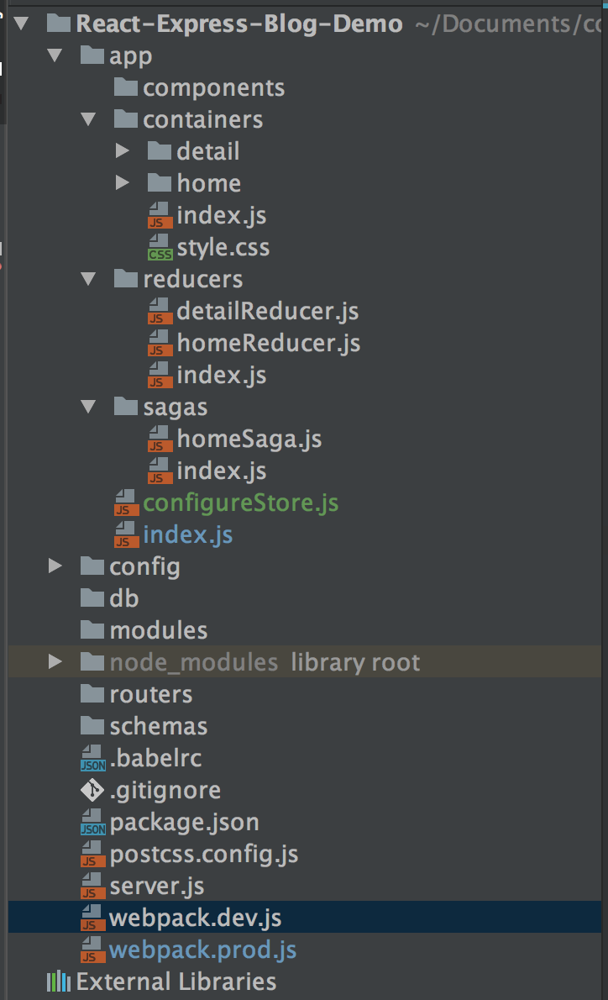
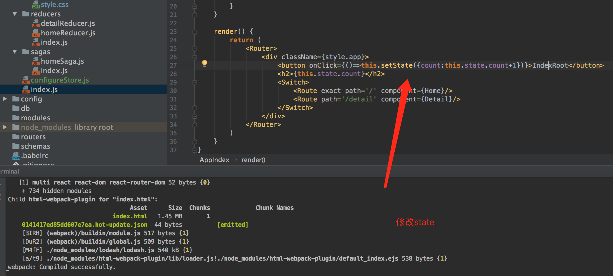

# 使用webpack实现react的热更新

>单独把热更新拿出来，是因为它的配置稍微比较繁琐。网上也各说风云，这里就上个demo，说下个人的实现吧

## 前言

项目结构大致如下：


app 中自然就是源代码，app/index.js是最外层的js文件。因为涉及到是热更新，所以当然是在我们的 webpack.dev.js 文件下操作。

webpack的常规配置这里不再赘述。项目的打包主要通过 server.js 文件

## webpack-dev-middleware

webpack dev server 是一个开发服务器，內建 webpack 使用的 live reloading 功能。

这里的使用其实就是当做一个Express中间件来使用的，用于服务webpack的包。


### 安装webpack-dev-middleware

```npm i webpack-dev-middleware --save-dev```

### 配置webpack-dev-middleware

>这里我直接粘贴了 server.js 的代码

    const Webpack = require('webpack');
    const WebpackDevMiddleware = require('webpack-dev-middleware');
    const config = require('./webpack.dev');
    
    const app = new (require('express'))();
    const port = 3000;
    
    const compiler = Webpack(config);
    app.use(WebpackDevMiddleware(compiler, {
        publicPath: config.output.publicPath,
        stats: {colors: true},
        lazy: false,
        watchOptions: {
            aggregateTimeout: 300,
            poll: true
        },
    }));
    
    app.get('/', function (req, res) {
        res.sendFile(__dirname + '/build/index.html');
    });
    
    app.listen(port);

通过运行server.js即可进行打包，因为webpack提供了express的middleware，让我们可以处理静态资源文件而不需要使用express.static。而打成这像功能，就是我们配置的webpack-dev-middleware

简单说下上面devMiddle的配置：

* publicPath:这里我导入的是webpack中的输出publicPath，注意：这是一个必填项。其实就是告诉index.html页面相对于浏览器地址怎么拿到他要拿到的js。
* stats:非必填项，这里的color，就是指console统计日志带颜色输出。
* lazy:指示是否懒人加载模式。true表示不监控源码修改状态，收到请求才执行webpack的build。false表示监控源码状态，配套使用的watchOptions可以设置与之相关的参数。

### 小结

到这一步，我们不需要再运行webpack命令去打包文件了，我们可以直接
```nodemon
node server.js
```
然后修改我们的源码文件你可以在控制台中发现，他会自动打包。

打开浏览器，127.0.0.1:3000 可以看到我们的的项目，修改后刷新就可以看到修改后的效果。

当然，我们任务还没结束。目前只是实现了不需要手动打包了，但是还是要手动刷新哇！

## 热更新

热更新，就是让我们更改完源码后，不需要再浏览器上手动刷新即可看到效果。解放我们的双手有木有

### 安装插件

```nodemon
npm i --save-dev webpack-hot-middleware
```

### 修改配置文件

这里我们需要修改三个地方的配置文件：webpack.dev.js  server.js index.js

server.js 添加一个中间件

```nodemon
const WebpackHotMiddleware = require('webpack-hot-middleware');
...
app.use(WebpackHotMiddleware(compiler));
```

webpack.dev.js

入口文件部分修改如下：

    entry: {
            index: [
                'react-hot-loader/patch',
                'webpack-hot-middleware/client',
                'babel-polyfill',
                pathLib.resolve(ENTRY_PATH, 'index.js')
            ],
            vendor: ['react', 'react-dom', 'react-router-dom']
        },

    
 插件部分添加上 HotModuleReplacementPlugin
 
```javascript
new webpack.HotModuleReplacementPlugin()
```
一切都给你打包好了，得告诉前端来接收下：
index.js 部分：

```
if(module.hot){
    module.hot.accept();
}
```
### 小结
这个时候当我们再次运行
```nodemon
node server.js
```
的时候，启动浏览器，可以看到当我们修改源码文件后，浏览器会自动的刷新的。

### 问题



代码如上。当我点击button，state也会随之增加。但是这个时候如果我修改了某一个文件内容，可以看到我浏览器的确刷新了。但是！state却重置到了1，这并不是我们想要的。

## 热更新保留组件状态

之前的我们只需要安装 babel-preset-react-hmre ,然后配置 .babelrc 文件就可以完美解决了。但是目前这个插件已经放弃维护了。推出了 react-hot-loader 插件。目前还都是在测试版。但是可以使用。

这里我们使用的版本时 ***3.0.0-beta.6***

### 安装插件
```nodemon
npm i --save-dev react-hot-reload
```
### 修改配置文件

.bebelrc

    {
      "presets": ["es2015","react","stage-0","env"],
      "plugins": ["react-hot-loader/babel"],
      "env": {
        "production":{
          "preset":["react-optimize"]
        }
      }
    }
    
在plugins中添加 react-hot-loader/babel

webpack.dev.js entry 部分修改:

    entry: {
            index: [
                'react-hot-loader/patch',
                'webpack-hot-middleware/client',
                'babel-polyfill',
                pathLib.resolve(ENTRY_PATH, 'index.js')
            ],
            vendor: ['react', 'react-dom', 'react-router-dom']
        },

修改index.js文件

```nodemon
import {AppContainer} from 'react-hot-loader'
...
render(
    <AppContainer >
        <IndexApp/>
    </AppContainer>
    ,
    mountNode
);
```

注意 3.0.0-beta.6 通过component属性传组件也是可以的。

### 完结

至此，我们就已经实现了，修改源码后 ，浏览器自动刷新的效果了，并且还保留了刷新前的state状态。

### 说明

这是我写一个博客系统的demo（项目还在进行中）配置中的一部分。

项目地址： https://github.com/Nealyang/React-Express-Blog-Demo

喜欢的朋友可以关注我的公众号，交流更多前端知识总结demo实战，让你我共赢！


