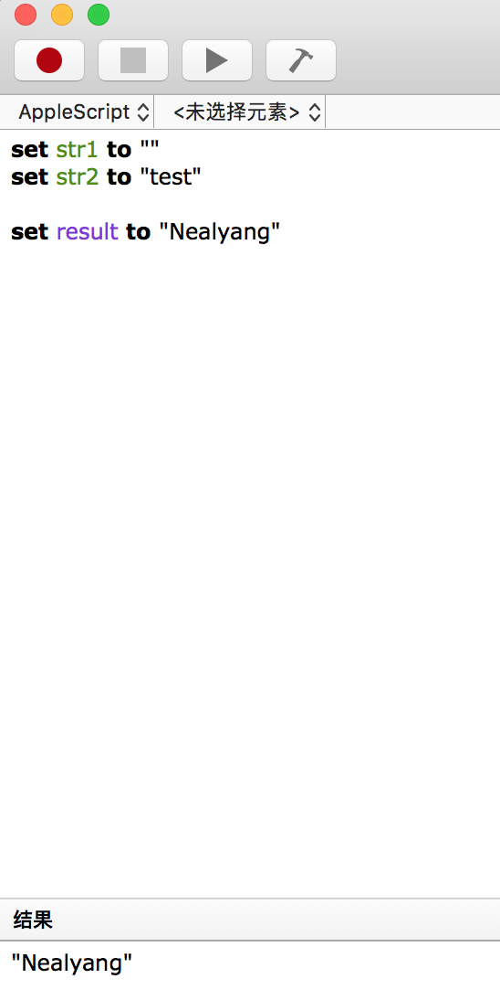

# AppleScript脚本入门

>作为入门文章，这里尽量写的简单明了一点。况且，AppleScript本身也是一个非常容易的脚本语言。

## 介绍
作为脚本语言，其实就是一些指令的集合。这种语言和英语类似，因此也易读、易写、易于理解。
他的作用也就是让计算机程序之间的沟通成为可能。

## 初试AppleScript
脚本就是一系列的指令。
工具：


### 基本操作：

command+k --->  编译

command+r --->  运行

control+点击编辑区上半部分 --->  提示

### 认识脚本的编写
直接上代码：

    say "Let's study applescript" using "Fred"
    beep 2
 
上面的代码就是让计算机发声。最后发两次“咚”的声音。
省略using关键字，就是用默认的朗读语音。

    tell application "Finder"
        empty the trash
    end tell
    
 上面的代码是调用Finder程序，去清空回收站里面的垃圾。
 
 tell关键字调用程序。end tell 结束调用。
 
 ### 结束语
 是不是感觉这个脚本非常简单且好玩？OK，下面接着一点点来捋一捋他的基本操作吧。
 
 ## 处理数字
 
 ### 变量
 AppleScript也是用变量
 
     set x to 25
 
 这里，就设置了一个x变量，存储着25这个值。
 注意，变量名是一个词组成，中间不能有空格。当然，我们不能够使用AppleScript中的保留字来作为变量名。当然，不能以数字开头，但是数字可以出现在变量名中间，下划线也是可以的。
 
 ### 计算
 ```nodemon
set width to 8
set height to 9
set area to width * height
```
上面的脚本大家应该看一下就懂。

属于叫做运算符，常用的运算符有：+、-、*、/、^、   对的，加减乘除乘方

## 处理文本
>文本也就是我们常说的字符串

### 弹窗



由于结果区只能显示最后一行语句的执行结果。所以这里我们使用对话框（display dialog）的形式来演示。

注意：AppleScript是一个由有限词汇构成的一个脚本语言，阅读你写的脚本的时候，
判别哪些是指令，哪些不是。对于Mac微机来说是一件非常复杂的一件事。
所以AppleScript需要依赖一些线索帮助其 读懂脚本中语句行的各个元素的含义。这就是为什么要把字符串放到双引号里面。

对于上述，测试如下脚本 ：

    set stringToBeDispalyed to "hi there"
    display dialog "stringToBeDisplayed"
    display dialog stringToBeDispalyed

### 字符串操作

#### 拼接

    set nameOfActress to "Neal is "
    set actressRating to " very pretty"
    set resultingString to nameOfActress & actressRating
    display dialog resultingString

& 是用来拼接字符串。

### 查看字符串长度

```set theLength to the length of "Neal"```

the length of 用来获取字符串的长度。这里顺便说一句，字符串中特殊字符是需要转义的。

### 类型转换

通过上面的学习，你应该知道数字和字符串不是一个数据类型，所以将一种数据类型转换到另一种数据类型，叫做数据类型转换。AppleScript数据类型转换如下：
    
    set strToNumber to "16" as number
    set numToStr to 12 as string
    
## list
>弱类型语言中的数组

```set exampleList to {1,2,3,"hahah",9}```

上面的exampleList即是一个列表。

### 操作

#### 向列表的开头和结尾处添加
代码如下:
    
    set addToBegin to {"winter"}
    set addToEnd to {"summer", "autumn"}
    set currentList to {"spring"}
    set modifiedList to addToBegin & currentList & addToEnd

对的，这里我们依旧使用 & 来做拼接。

### 取值
你可以使用元素的序号来取代元素，最左边的index是1，其实是2，以此类推。可以使用这种方式来从列表中取值，也可以修改类表中值。

    set testList to {"Neal", "haha"}
    set item 2 of testList to "yang"
    get testList
    
对于第二句，同样的效果还有：

    set the second item of testList to "yang"
    set the 2nd item of testList to "yang"
    
简直和英语一毛一样有么有。但是注意上面这种一字母拼写的序 数词最多只能使用到“tenth”，
之后，就要使用“item 11”的形式。或者写成 “11th item”的形式。
除了使用序数词，还可以使用“last item”指代列表中最后项目。

所以，当你只操作列表中最后一个值的时候，你不必知道列表具体有多少项目。
AppleScript允许你以相反的方向来指代元素，也就是可以从右向左数。这需要你使用负数，-1 指代最后一个元素，
-2指代倒数第2个元素。例[11]可以获得和例[10]一样的结果

    set myList to {"neal", "haha"}
    set valueOfLastItem to item -1 of myList

下面展示下，如何一次去多个值。

    set myList to {"a", "b", "c", "d", "e", "f"}
    set shortList to items 2 through 5 of myList
    
是的，上面就是运行结果为： {"b", "c", "d", "e"}

### reverse
```set reversedList to reverse of {2, 3, 4, 6, 7}```

> {7, 6, 4, 3, 2}

### 获取数组长度

    set theListLength to the length of {"ds", 1, 2, 3}
    set theListLength to the count of {"ds", 1, 2, 3}
    
the length of 和 the count of 效果是一样的。就是获取列表的长度

### 随机取值

set x to some item of {1, 2, 3, 4, 5, 7, 7, 6, 5}

> 随机返回列表中的任一元素

### 类型转换

    set myList to {"a"}
    set myString to "b"
    --set result to myList & (myString as list)
    set result to myList & myString
    
感觉可以对于js学习，弱类型语言都可以自动类型转换的。

除了通过类型转换将一个字符串变成一个列表，你还可以创建一个列表，列表的元素是组成字 符串的每一个字母。

`set itemized to every character of "Nealyang"`
> {"N", "e", "a", "l", "y", "a", "n", "g"}

相比于单词，我们还可以把一个句子按照单词分开。这里我们可以使用苹果脚本的去限器( AppleScript’s text item delimiters)实现

首先定义一个字符作为分割文本的标记，以这个标记 分割出来的元素将被包含在列表里。

优秀的脚本编写要求如果苹果脚本文本去限器的值被更改了，一旦完 成任务还要将它改回原来的值

    set myString to "neal's personal website is www.nealyang.cn"
    set oldDelimiters to AppleScript's text item delimiters
    set AppleScript's text item delimiters to " "
    set myList to every text item of myString
    set AppleScript's text item delimiters to oldDelimiters
    get myList
    
> {"neal's", "personal", "website", "is", "www.nealyang.cn"}

注意这里设置完 AppleScript's text item delimiters 后，分割用 every text item of 不是every character of

空格 " "我们是可以自定义的。类似js中split

## record
> 理解为js中的对象吧

    set stringToBeDisplayed to "Neal is pretty boy"
    set tempVar to display dialog stringToBeDisplayed buttons {"So,so", "Don't know", "yes"}
    set theButtonPressed to button returned of tempVar
    display dialog "You pressed the following button " & theButtonPressed
    
上面的 button returned of 就是取值的语句。
因为dialog按钮按下后会返回如下格式：{"button returned":"xxxx"}

简单的操作如下：
```
    set test to {neal:"yang"}
    set lala to neal of test
   ```
   
## 注释

注释很简单

-- 注释一行

\# 注释一行

(*xxx*) 注释多行

## 条件语句

我们把“if...then”指令叫做“条件语句”(conditional statement)。请注意，条件语句 还需要一个“end if”收尾。

比较简单，直接上代码吧：

    set ageEntered to 73
    set myAge to 24
    if ageEntered is myAge then
        display dialog "You are as old as I am "
        beep
    end if
    say "this sentence is spoken anyway"

当然，我们也可以在 if ... then ... 和 end if 之间加上 else 关键字。
如果“if...then”指令和要执行的语句写在同一行，那么就不再需要“end if”

## 错误捕获
意外的终止是我们所不希望的。比如，你的脚本需要打开一个文件夹处理其中的文件， 但是这个文件夹已经被删除了，你会希望脚本允许用户选择其它合适的文件夹，而不是意外退出。

你可以把这些可能引起运行错
误的语句放入“try...end try”模块中

    try
        set x to 1 / 0
    on error the error_message number the error_number
        display dialog "Error: " & the error_number & "." & the error_message buttons {"OK"}
    end try

>Error: -2701.1.0 不能被零除  

如果你在“on error”指令后面放上一个变量名，那么错误描述信息将被赋给这个变量。如果你 在变量名前面加上“number”字样，那么错误代码将被赋给变量。

## 路径、文件夹和应用程序

先是硬盘，硬盘下面包含文件夹、应用程序和文件(上图中没有显示出文件和应用程序)。所 有这些元素按照一定的层次组织起来。
这样我们就可以通过路径(path)这个概念来确定一个文件 的位置

运行

`choose folder`

>alias "Macintosh HD:Users:Nealyang:Documents:code:code-work:huilianyi:hooks:"

你可以发现，路径一般的都符合这样的格式:
硬盘:文件夹:子文件夹:子文件夹:

    tell application "Finder"
        open folder "Macintosh HD:Users:Nealyang:Documents:code:code-work:huilianyi:hooks:"
    end tell
    
注意上面的alias。假如我在桌面上为“Documents”文件夹中的文件“report.cwk”创建了一个替身。如果今后我 移动“report.cwk”到其它位置，或者把它重命名为“funny_story.cwk”，双击替身依然能够打开这 个文件。这是因为替身并不以“Macintosh HD:users:Documents:report.cwk”的方式记录文件 “report.cwk”
 的存储位置(和名字)，而是记录这个文件的ID。
 
 为了避免因为文件被移动或改名造成的脚本运行中断，我们应当让脚本记录文件的ID而不是 “符号链接”的路径
 
 
    set thePath to alias "Macintosh HD:Users:Nealyang:Documents:code:code-work:huilianyi:hooks:README.md"
    
 ## 重复（循环）
 
 关键字 repeat ... end repeat 
 
 列出所选文件夹中所有的文件夹名称
 
     set folderSelected to choose folder "Select a folder"
     tell application "Finder"
        set listOfFolders to every folder of folderSelected
     end tell
     
     set theList to {}
     repeat with aFolder in listOfFolders
        set temp to the name of aFolder
        set theList to theList & temp
     end repeat
     
 ## 函数
 
 这个比较简单，容易理解。

    on test(lala)
        display dialog lala
    end tst
    
    
    test("haha")
    
上面就是定义了一个test函数，然后下面是调用

下面一个return的例子

    on largest(a, b)
        if a > b then
            return a
        end if
        return b
    end largest
    
    set theLargetst to largest(4, 6)

## 结束语    
如上就是AppleScript大概的基本知识，如果对他感兴趣，就赶快动手来写一写有意思的Mac脚本吧~